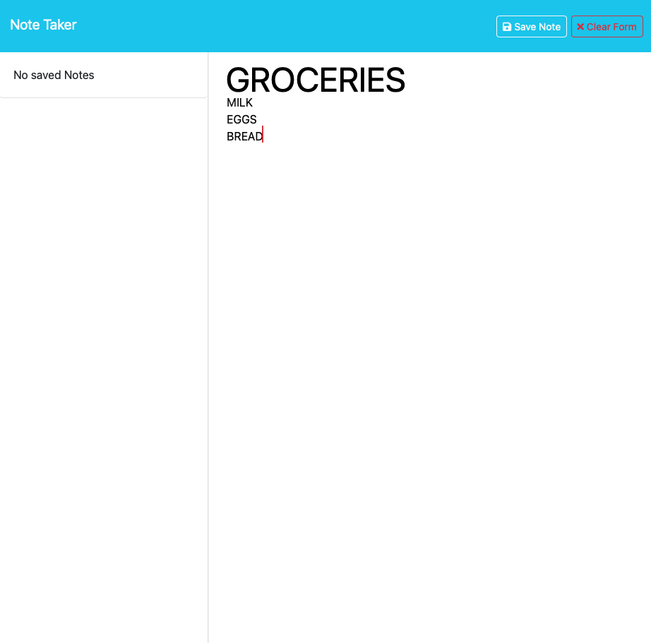

# NOTE TAKER

## Description

Simple note taker for daily tasks.

## Table of Contents

- [Installation](#installation)
- [Usage](#usage)
- [Credits](#credits)
- [License](#license)
- [Features](#features)
- [Contributing](#contibuting)
- [Tests](#tests)
- [Questions](#questions)

## Installation

- To use locally clone repo.
- Open terminal and run `npm install`.
- Start server by running `node server.js`.

## Usage

- Click on <a href="https://morning-sands-26761-fdd1c7542253.herokuapp.com/notes">Deployed Heroku Link</a> to access.
- Create note with title and description and click save.
- Repeat for new notes.
- Click on saves title on left side of app to a edit notes.
- Click delete to trash old notes.

## Credits

- Starter code was provided by UTA Coding Bootcamp.
- CHATGPT 3.5
- Class instructors and TAs

## License

## Features

## Contributing

## Tests

## Questions

If you have questions, you can contact me at [cimarron13@mac.com](mailto:cimarron13@mac.com) or <a href="https://github.com/cjenschke">GitHub</a>.
